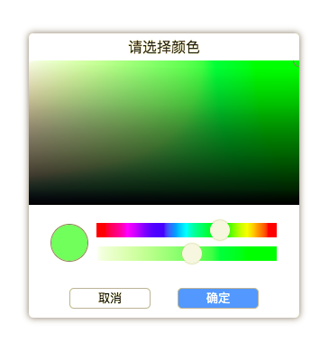

<p align='center'>
  
</p>

# [colors-picker](https://hai2007.github.io/colors-picker/)
一个类似浏览器调试工具中颜色选择器的H5版本的小组件。

<p>
  <a href="https://hai2007.gitee.io/npm-downloads?interval=7&packages=colors-picker"></a>
  <a href="https://www.npmjs.com/package/colors-picker"></a>
  <a href="https://github.com/hai2007/colors-picker/blob/master/LICENSE"></a>
  <a href="https://github.com/hai2007/colors-picker">
        
    </a>
</p>

## Issues
使用的时候遇到任何问题或有好的建议，请点击进入[issue](https://github.com/hai2007/colors-picker/issues)！

## How to use?

首先你需要通过命令行安装，就像这样：

```js
npm install --save colors-picker
```

安装好了以后，引入：

```js
import ColorsPicker from 'colors-picker';
```

然后，你需要在页面中准备一个可点击的节点，比如一个```button```标签：

```html
<button id='target'>按钮</button>
```

最后，挂载点击交互即可：

```js
ColorsPicker(document.getElementById('target'), '#1eff0087').then(function (color) {
    document.getElementById('target').style.backgroundColor = color;
});
```

具体的使用你可以[查阅文档](https://hai2007.github.io/colors-picker)哦~

开源协议
---------------------------------------
[MIT](https://github.com/hai2007/colors-picker/blob/master/LICENSE)

Copyright (c) 2021-2022 [hai2007](https://hai2007.github.io/SweetHome/) 走一步，再走一步。
